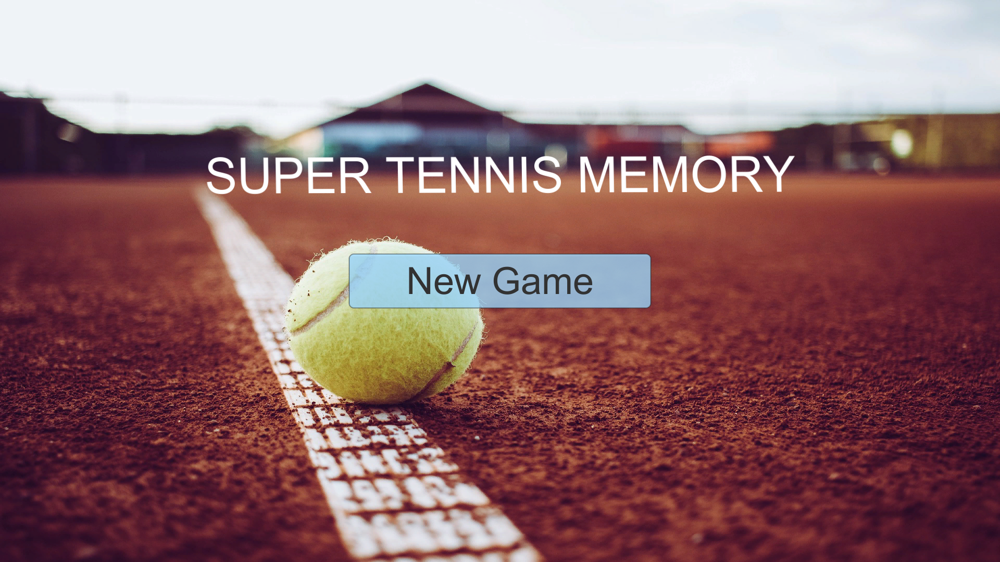
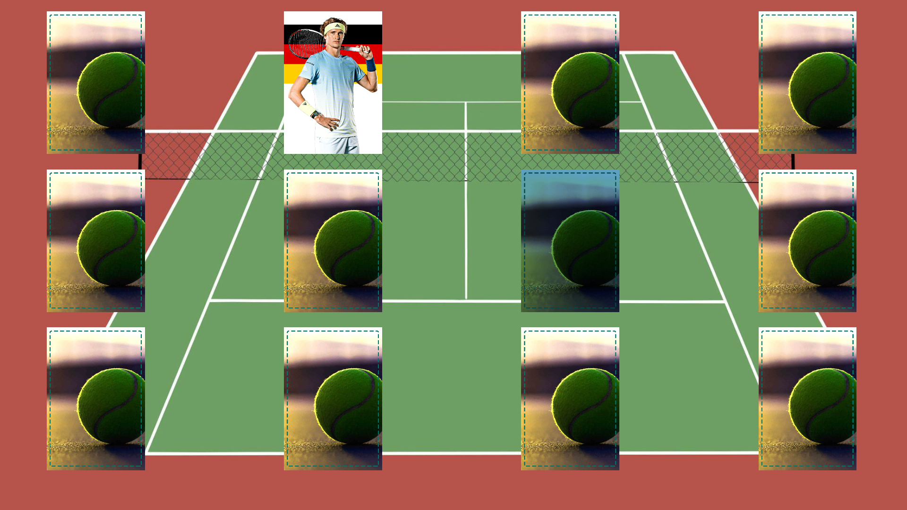
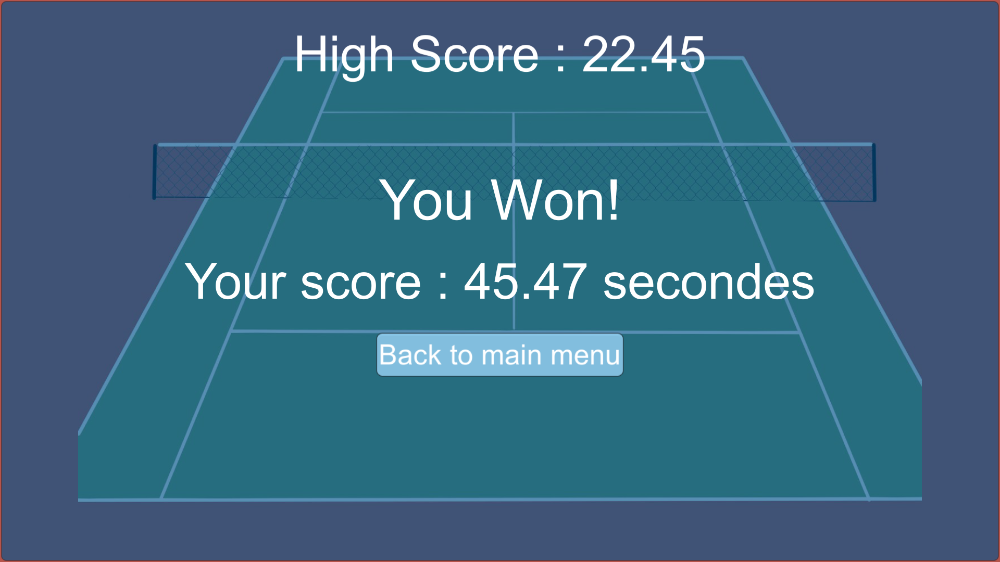

# Tennis Memory

Réalisé dans le cadre d'un test. Petit jeu de memory lié au tennis comprenant un menu d'accueil, 6 paires à trouver et un menu de fin avec un highscore.
Le jeu comprend également de la musique, des bruitages et des animations.
Étant donné qu'il a été réalisé dans un cadre privé, certaines images ne sont pas libres de droits et sont tirées, par exemple, du site de  l'ATP.

